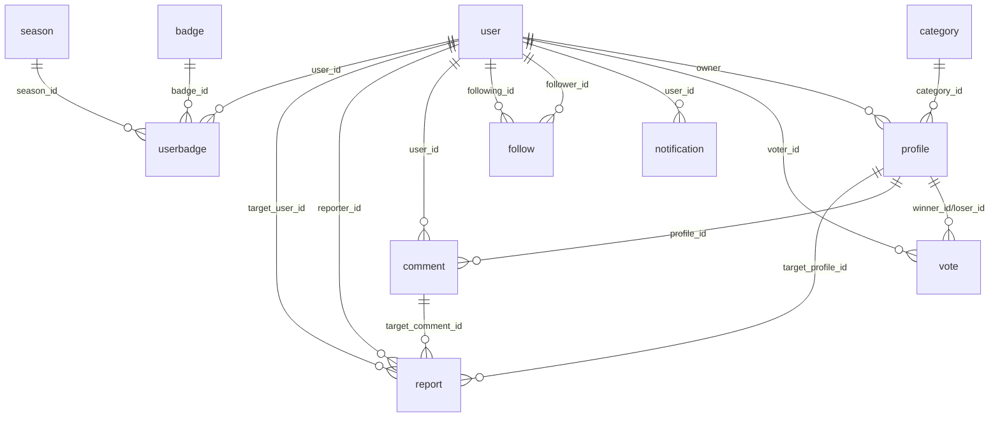

# YoUprefer — Reporte técnico (arquitectura, BD, stack, requisitos y seguridad)

## 1. Visión general
YoUprefer (antes “Carómetro”) es una plataforma de votación social por comparaciones directas (A vs B) para construir rankings tipo Elo. El sistema permite subir perfiles (fotos), votar, visualizar rankings globales/categorizados, seguir usuarios, recibir notificaciones y administrar/moderar contenido.

**Aplicaciones**
- **Backend API** (FastAPI): expone REST + WebSocket, gestiona auth, reglas de negocio, DB y caché.
- **Frontend web** (Next.js App Router): UI web que consume la API y gestiona sesión con refresh token.
- **App mobile** (Expo/React Native): UI móvil con consumo de API (sesión simplificada respecto a web).

## 2. Arquitectura y flujo de datos

### 2.1 Diagrama lógico
```mermaid
flowchart LR
  W[Frontend Web (Next.js)] -->|HTTPS REST| API[Backend FastAPI]
  M[Mobile (Expo RN)] -->|HTTPS REST| API
  W -->|WSS ws/notifications?token=...| API
  API -->|SQL| PG[(PostgreSQL)]
  API -->|Cache + PubSub + blacklist| R[(Redis)]
  API -->|S3-compatible| R2[(Cloudflare R2)]
```

### 2.2 Capas del backend (cómo está organizado)
- **Entrada**: [main.py](file:///Users/nuevomac/Documents/YoUprefer/backend/app/main.py) configura CORS, GZip y registra routers.
- **Routers por dominio**: [api.py](file:///Users/nuevomac/Documents/YoUprefer/backend/app/api/api_v1/api.py) agrupa endpoints por módulos.
- **Dependencias / auth**: [deps.py](file:///Users/nuevomac/Documents/YoUprefer/backend/app/api/deps.py) resuelve DB sessions, usuario actual (JWT) y roles.
- **Servicios (business logic auxiliar)**: [services/](file:///Users/nuevomac/Documents/YoUprefer/backend/app/services/) encapsula storage (R2), Elo/ranking, temporadas, badges.
- **Persistencia**:
  - Modelos ORM: [models/](file:///Users/nuevomac/Documents/YoUprefer/backend/app/models/).
  - Engine/sessions: [session.py](file:///Users/nuevomac/Documents/YoUprefer/backend/app/db/session.py).
  - Migraciones: [alembic/](file:///Users/nuevomac/Documents/YoUprefer/backend/alembic/).

### 2.3 Rutas principales de la API (por módulo)
Prefijo base: `API_V1_STR=/api/v1` (ver [config.py](file:///Users/nuevomac/Documents/YoUprefer/backend/app/core/config.py)).

- **Auth** (prefijo `/auth`):
  - `POST /auth/register`
  - `POST /auth/login/access-token`
  - `POST /auth/refresh-token`
  - `POST /auth/logout`
  - `POST /auth/password-recovery/{email}`
  - `POST /auth/reset-password/`
  - Implementación: [auth.py](file:///Users/nuevomac/Documents/YoUprefer/backend/app/api/api_v1/endpoints/auth.py)
- **Users** (prefijo `/users`):
  - `GET /users/me`, `PUT /users/me`
  - `POST /users/me/avatar`
  - Seguimientos: follow/unfollow, followers/following, stats
  - Implementación: [users.py](file:///Users/nuevomac/Documents/YoUprefer/backend/app/api/api_v1/endpoints/users.py)
- **Profiles / Ranking** (prefijo `/profiles`):
  - Pair para voto: `GET /profiles/pair`
  - Subida: `POST /profiles/` y `POST /profiles/upload-direct`
  - Estado: `GET /profiles/me`, `GET /profiles/me/participation-status`
  - Ranking: `GET /profiles/ranking`
  - Salir/eliminar: `POST /profiles/{id}/leave`, `DELETE /profiles/{id}`
  - Comentarios: `GET/POST /profiles/{id}/comments`
  - Implementación: [profiles.py](file:///Users/nuevomac/Documents/YoUprefer/backend/app/api/api_v1/endpoints/profiles.py)
- **Votes** (prefijo `/votes`):
  - `POST /votes/` registra voto y actualiza ELO
  - Implementación: [votes.py](file:///Users/nuevomac/Documents/YoUprefer/backend/app/api/api_v1/endpoints/votes.py)
- **Notifications** (sin prefijo en `include_router`, rutas explícitas):
  - `GET /notifications`, `PATCH /notifications/{id}`, `POST /notifications/mark-all-read`
  - WebSocket: `WS /ws/notifications?token=...`
  - Implementación: [notifications.py](file:///Users/nuevomac/Documents/YoUprefer/backend/app/api/api_v1/endpoints/notifications.py)
- **Categories** (prefijo `/categories`):
  - `GET /categories/`, `POST /categories/`
  - Implementación: [categories.py](file:///Users/nuevomac/Documents/YoUprefer/backend/app/api/api_v1/endpoints/categories.py)
- **Badges** (prefijo `/badges`):
  - `GET /badges/`, `GET /badges/me`, `GET /badges/progress`, `POST /badges/check`
  - Implementación: [badges.py](file:///Users/nuevomac/Documents/YoUprefer/backend/app/api/api_v1/endpoints/badges.py)
- **Reports** (prefijo `/reports`):
  - `POST /reports/`, `GET /reports/`, `PATCH /reports/{id}`
  - Implementación: [reports.py](file:///Users/nuevomac/Documents/YoUprefer/backend/app/api/api_v1/endpoints/reports.py)
- **Admin** (prefijo `/admin`):
  - Moderación: `GET /admin/pending`, `POST /admin/{profile_id}/approve`, `POST /admin/{profile_id}/reject`
  - Temporada: `POST /admin/season/reset`
  - Moderación comentarios: `DELETE /admin/comments/{comment_id}`
  - Implementación: [admin.py](file:///Users/nuevomac/Documents/YoUprefer/backend/app/api/api_v1/endpoints/admin.py)

### 2.4 Frontend web (diseño)
- Estructura por páginas (App Router): [src/app](file:///Users/nuevomac/Documents/YoUprefer/frontend/src/app).
  - Ejemplos: `/login`, `/register`, `/vote`, `/ranking`, `/profile`, `/upload`, `/admin`, `/settings`.
- Estado de auth:
  - Context: [AuthContext.tsx](file:///Users/nuevomac/Documents/YoUprefer/frontend/src/context/AuthContext.tsx)
  - Cliente HTTP con refresh token y retry ante 401: [api.ts](file:///Users/nuevomac/Documents/YoUprefer/frontend/src/lib/api.ts)
- UI: componentes en [components/](file:///Users/nuevomac/Documents/YoUprefer/frontend/src/components) y estilo global en [globals.css](file:///Users/nuevomac/Documents/YoUprefer/frontend/src/app/globals.css).

### 2.5 Mobile (diseño)
- Navegación por tabs: [mobile/app/(tabs)](file:///Users/nuevomac/Documents/YoUprefer/mobile/app/(tabs)).
- Cliente API y token:
  - Base URL por `EXPO_PUBLIC_API_URL` con fallback para emulador Android: [mobile/lib/api.ts](file:///Users/nuevomac/Documents/YoUprefer/mobile/lib/api.ts)
  - Persistencia de token en SecureStore: [mobile/lib/storage.ts](file:///Users/nuevomac/Documents/YoUprefer/mobile/lib/storage.ts)
- Diferencia clave respecto a web: el cliente móvil **no guarda refresh token**, por lo que la expiración obliga a re-login.

## 3. Diseño de base de datos (PostgreSQL)

### 3.1 Convenciones y migraciones
- SQLAlchemy Base autogenera `__tablename__` con `lower()` del nombre de clase: [base_class.py](file:///Users/nuevomac/Documents/YoUprefer/backend/app/db/base_class.py).
- Alembic toma metadata desde `Base.metadata`: [alembic/env.py](file:///Users/nuevomac/Documents/YoUprefer/backend/alembic/env.py).
- Migración inicial: crea `user`, `profile`, `vote` ([5f03bf...](file:///Users/nuevomac/Documents/YoUprefer/backend/alembic/versions/5f03bf757949_initial_migration.py)).

### 3.2 Entidades y relaciones (resumen)


### 3.3 Tablas principales (campos relevantes)
- **user**: email único, password hash, flags, `avatar_url`, `created_at`. Ver [user.py](file:///Users/nuevomac/Documents/YoUprefer/backend/app/models/user.py).
- **profile**: `type` (REAL/AI), `gender`, `image_url`, ELO/contadores, FK opcional `user_id`, FK opcional `category_id`, flags `is_active/is_approved`, consentimiento legal, timestamps. Ver [profile.py](file:///Users/nuevomac/Documents/YoUprefer/backend/app/models/profile.py).
- **vote**: winner/loser (profiles), voter (user opcional) + timestamp. Ver [vote.py](file:///Users/nuevomac/Documents/YoUprefer/backend/app/models/vote.py).
- **category**: `name` y `slug` únicos, `is_active`. Ver [category.py](file:///Users/nuevomac/Documents/YoUprefer/backend/app/models/category.py).
- **follow**: follower/following (users), unique `(follower_id, following_id)`. Ver [follow.py](file:///Users/nuevomac/Documents/YoUprefer/backend/app/models/follow.py).
- **notification**: `type`, `payload` JSON, `is_read`, timestamp. Ver [notification.py](file:///Users/nuevomac/Documents/YoUprefer/backend/app/models/notification.py).
- **comment**: `profile_id`, `user_id`, `content`. Ver [comment.py](file:///Users/nuevomac/Documents/YoUprefer/backend/app/models/comment.py).
- **report**: reporter + target opcional (profile/user/comment) y `status`. Ver [report.py](file:///Users/nuevomac/Documents/YoUprefer/backend/app/models/report.py).
- **badge/season/userbadge**: catálogo de insignias, temporadas y asignación al usuario. Ver [badge.py](file:///Users/nuevomac/Documents/YoUprefer/backend/app/models/badge.py).

## 4. Stack tecnológico (fuente de verdad: manifests)

### 4.1 Backend
- Runtime: Python (repo contiene evidencia de ejecución con 3.14 en `.pyc`, pero el README indica 3.11+).
- Framework: FastAPI + Uvicorn.
- Persistencia: SQLAlchemy + Alembic.
- Drivers: `psycopg2-binary` (sync), `asyncpg` (async).
- Seguridad: `python-jose[cryptography]`, `passlib`, `python-multipart`.
- Cache/realtime: `redis` (blacklist, pubsub, caching).
- Storage: `boto3` para R2.
- Tests: `pytest`, `pytest-cov`, `httpx`, `pytest-asyncio`.

### 4.2 Frontend web
- Next.js: `16.1.5` (ver [frontend/package.json](file:///Users/nuevomac/Documents/YoUprefer/frontend/package.json)).
- React: `19.2.3`.
- Tailwind CSS 4 + utilidades (`clsx`, `tailwind-merge`).
- Tests: Jest + Testing Library.

### 4.3 Mobile
- Expo: `~54`.
- React Native: `0.81`.
- Navegación: `expo-router`.
- Secure storage: `expo-secure-store`.

## 5. Requerimientos del sistema

### 5.1 Requerimientos funcionales (RF)
- RF-01 Registro de usuario y creación de cuenta.
- RF-02 Autenticación (login) y emisión de tokens (access/refresh).
- RF-03 Renovación de sesión (refresh token) y logout con revocación (blacklist en Redis).
- RF-04 Recuperación y reseteo de contraseña.
- RF-05 Gestión de perfil de usuario: ver/editar datos propios, subir avatar.
- RF-06 Subida de perfil (foto) para competir en ranking, con restricciones de participación activa.
- RF-07 Moderación de perfiles (aprobar/rechazar) por rol admin.
- RF-08 Obtención de pares A vs B para votar.
- RF-09 Registro de voto y actualización de ranking (ELO).
- RF-10 Visualización de ranking (global y por categoría) y filtros básicos (type/gender/categoría).
- RF-11 Gestión de categorías (listar y crear).
- RF-12 Comentarios sobre perfiles (listar/crear) y moderación (admin delete).
- RF-13 Sistema de seguimiento entre usuarios (follow/unfollow + listas/estadísticas).
- RF-14 Notificaciones: listar/leer/mark-all-read.
- RF-15 Notificaciones en tiempo real vía WebSocket (backend con Redis pubsub).
- RF-16 Gamificación: catálogo de insignias, progreso y badges del usuario.
- RF-17 Reportes de contenido/usuarios/comentarios y workflow de estado.
- RF-18 Panel admin para operaciones de moderación y “reset” de temporada.
- RF-19 Cliente móvil soporta login, navegación por tabs, ranking, perfil y upload con flujo de subida (R2 presigned).

### 5.2 Requerimientos no funcionales (RNF)
- RNF-01 Seguridad:
  - Passwords con hashing robusto (Passlib).
  - Tokens JWT firmados + expiración; refresh tokens diferenciados por claim `type`.
  - Protección contra abuso: rate limiting en endpoints críticos (ver [ratelimit.py](file:///Users/nuevomac/Documents/YoUprefer/backend/app/core/ratelimit.py)).
  - Manejo seguro de secretos y rotación (no commitear `.env`).
- RNF-02 Performance:
  - Cache Redis en endpoints de ranking/pair y invalidación controlada.
  - Índices en columnas de filtros frecuentes (ej. `profile.is_active`, `profile.is_approved`, `vote.winner_id/loser_id`).
  - Compresión GZip en respuestas grandes (ver [main.py](file:///Users/nuevomac/Documents/YoUprefer/backend/app/main.py)).
- RNF-03 Escalabilidad:
  - API stateless; sesión basada en tokens.
  - Redis para pubsub y blacklist permite múltiples instancias del backend.
- RNF-04 Disponibilidad y resiliencia:
  - Degradación razonable si Redis falla (en algunos puntos se captura excepción).
  - Healthcheck `/health` para monitoreo básico.
- RNF-05 Mantenibilidad:
  - Separación por módulos y servicios.
  - Migraciones Alembic versionadas.
  - Tests en backend y frontend (ver [backend/app/tests](file:///Users/nuevomac/Documents/YoUprefer/backend/app/tests) y [frontend/src/**.test.tsx](file:///Users/nuevomac/Documents/YoUprefer/frontend/src/components/ui)).
- RNF-06 Portabilidad:
  - Web + mobile consumen la misma API.
  - Config por variables de entorno (URLs y credenciales).

## 6. Hallazgos de seguridad y mejoras recomendadas (priorizadas)

### P0 (crítico)
- Secretos en `backend/.env` dentro del repo:
  - Rotar credenciales afectadas (R2 y cualquier secret key).
  - Eliminar `.env` del control de versiones y reemplazar por `.env.example`.
- CORS: `allow_origins=["*"]` junto con `allow_credentials=True` en fallback:
  - En prod: forzar lista explícita de orígenes y deshabilitar `*` con credenciales.
- WebSocket con token en querystring:
  - Evitar tokens largos en URL; preferir cookie segura o “ticket” de corta vida entregado por REST.
- Password recovery:
  - No imprimir tokens; integrar envío real (SMTP/servicio) y logging seguro.

### P1 (alto)
- `get_async_db()` usa `AsyncSessionLocal()` sin validar disponibilidad:
  - Unificar con la lógica defensiva de [backend/app/db/session.py](file:///Users/nuevomac/Documents/YoUprefer/backend/app/db/session.py) para error claro.
- Endurecimiento JWT:
  - Validar audience/issuer si aplica.
  - Reducir superficie de exposición (claims mínimos).
- Auditoría de logs:
  - Garantizar que nunca se loguean tokens, headers de auth o payloads sensibles.

### P2 (medio)
- Headers de seguridad en backend (ej. HSTS en prod, X-Content-Type-Options, Referrer-Policy) vía middleware/proxy.
- Política de contraseña (longitud mínima, bloqueo por intentos, verificación de leaks opcional).
- Revisión de almacenamiento de tokens en frontend (ataque XSS):
  - Evaluar mover tokens a cookies httpOnly (tradeoff con CSRF).

## 7. Notas de consistencia documental
- `TECHNICAL_DOCUMENTATION.md` menciona Next.js 14, pero el manifest indica Next 16. Ajustar documentación a manifests reales si se usará como “fuente de verdad”.

## 8. Verificación (smoke test) — estado y prerequisitos
- El backend requiere **Python 3.10+** (usa `str | None`), recomendado 3.11+.
- En este entorno de ejecución no están disponibles Node.js, Postgres CLI ni Redis CLI; y `python3` es 3.9.6, por lo que no es posible ejecutar el smoke test aquí.
- Pasos reproducibles para verificar en tu máquina: [LOCAL_SETUP.md](file:///Users/nuevomac/Documents/YoUprefer/LOCAL_SETUP.md).
